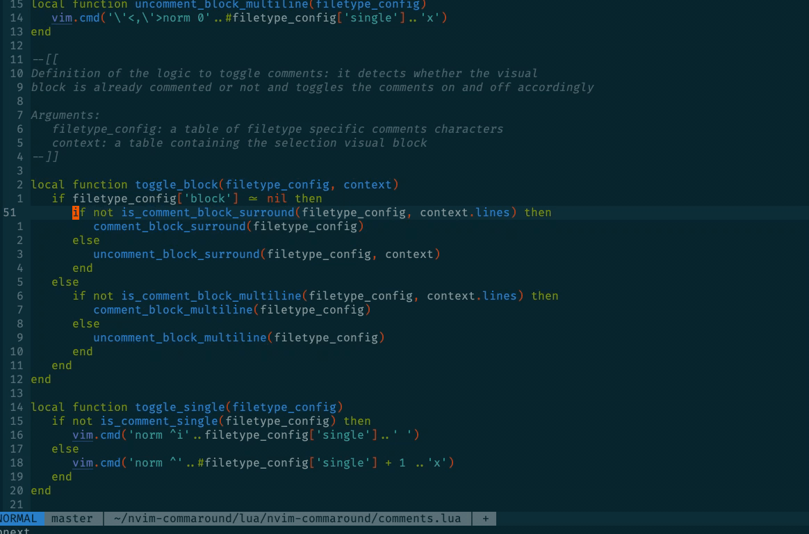

# nvim-commaround
`nvim-commaround` comes and goes around, comments up and down! It toggles comments for visual blocks or lines according to the buffer filetype: it works out of the box, it is awesome!

## Installation
Install it using your favourite plugin manager; for instance if you are using vim-plug
```
Plug 'gennaro-tedesco/nvim-commaround'
```

## Usage
Visually select the lines you want to act on and toggle commaround: the default mapping is
```
vmap <leader>c <Plug>ToggleCommaround
```
The plugin detects the buffer filetype and inserts block or line comments according to the selection.



## Customisation
The list of filetypes configuration characters can be found [here](https://github.com/gennaro-tedesco/nvim-commaround/blob/master/lua/nvim-commaround/config.lua). To add comment characters for a new filetype (or to modify the existing ones) specify the below in your nvim configurations (`init.vim` or any other option file being sourced at start-up), say
```
lua require('nvim-commaround.config').config["todo"] = {single = "--!", block = {left = "/*!", right = "!*/"}}
```
replacing "todo" with any specific filetype; leave `{single = "--!", block = nil}` in case no block comments are available.

To change the default mapping to toggle comments define any right hand side of the option
```
let g:toggle_commaround = 'gcc'
```
